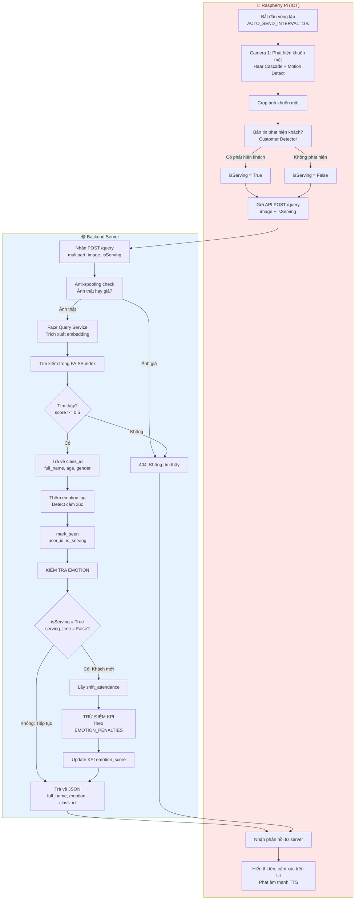
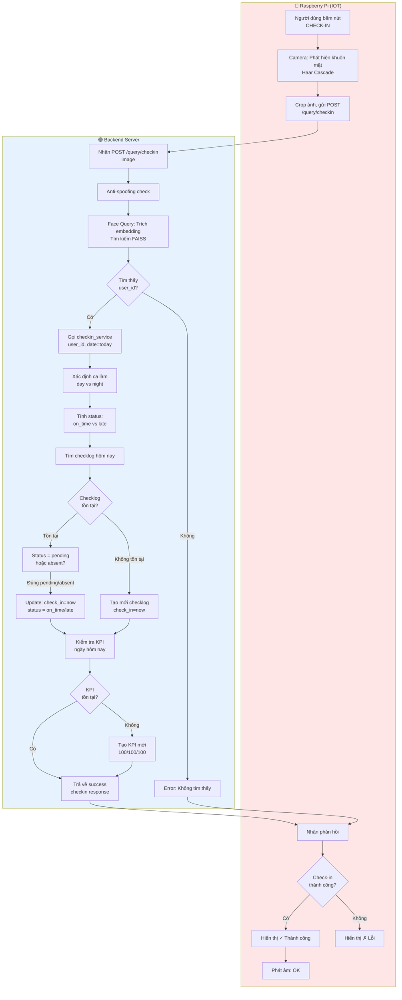
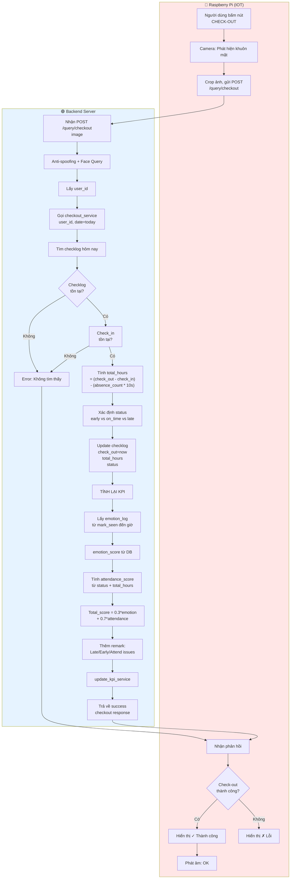
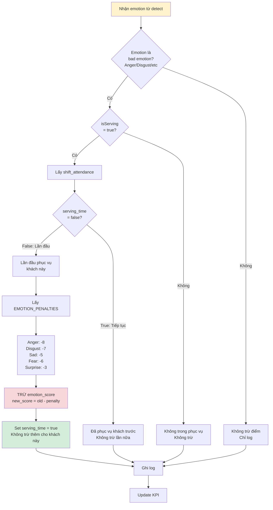
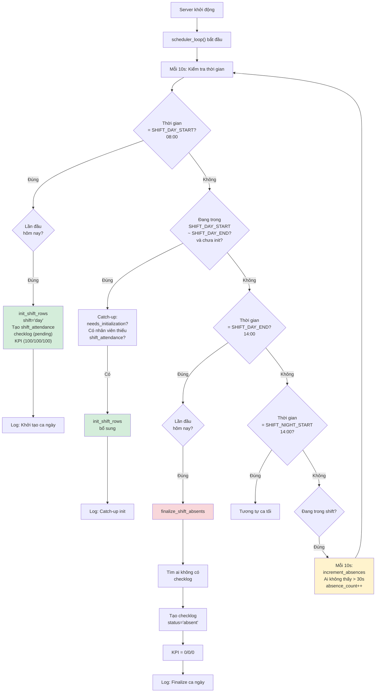
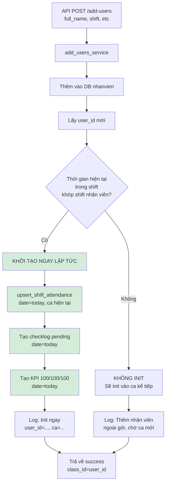
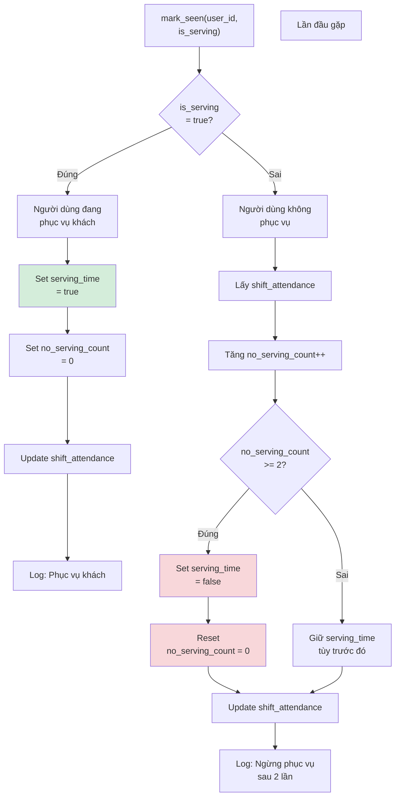

# Sơ Đồ Luồng Hệ Thống IOT + Backend (Mermaid)

Các sơ đồ dưới đây mô tả chi tiết luồng hoạt động từ Raspberry Pi đến Backend Server cho các API: `/query`, `/check-in`, `/check-out`.

---

## 1. Luồng /query (Nhận Diện Thường Xuyên)



---

## 2. Luồng /check-in (Chấm Công Bắt Đầu)



---

## 3. Luồng /check-out (Chấm Công Kết Thúc)



---

## 4. Chi Tiết: Serving Time + Emotion Penalty (Bên Trong /query)



---

## 5. Tích Hợp Scheduler: Khởi Tạo + Catch-up + Finalize



---

## 6. Quy Trình Thêm Nhân Viên (Hoàn Tất Flow)



---

## 7. Mark_Seen: Serving State Machine



---

## Ghi Chú Sử Dụng Draw.io

1. **Sao chép mã Mermaid**: Chọn toàn bộ nội dung mã trong mỗi khối `` ```mermaid ... ``` ``
2. **Mở Draw.io**: https://app.diagrams.net/
3. **Chèn Mermaid**: 
   - Chọn menu **File** → **New** → **Blank Diagram**
   - Hoặc kéo thả mã vào canvas
   - Hoặc từ menu: **Arrange** → **Insert** → **SVG/Mermaid**
4. **Chỉnh sửa**: Draw.io sẽ render sơ đồ, bạn có thể thay đổi màu, vị trí, nhãn.
5. **Xuất**: **File** → **Export as** → PNG/SVG/PDF

---

## Huyền Thoại Màu Sắc

- 🔴 **Raspberry Pi (RPi)** = Màu hồng (`fill:#ffe6e6`)
- 🟢 **Backend Server** = Màu xanh (`fill:#e6f3ff`)
- **Khởi tạo/Success** = Màu xanh nhạt (`fill:#d4edda`)
- **Trừ điểm/Lỗi** = Màu đỏ nhạt (`fill:#f8d7da`)
- **Hành động liên tục** = Màu vàng (`fill:#fff3cd`)
